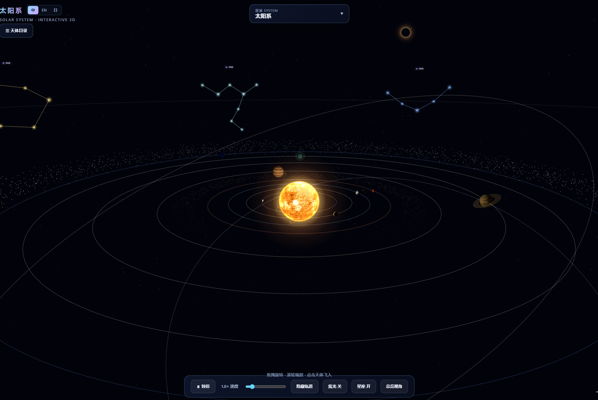
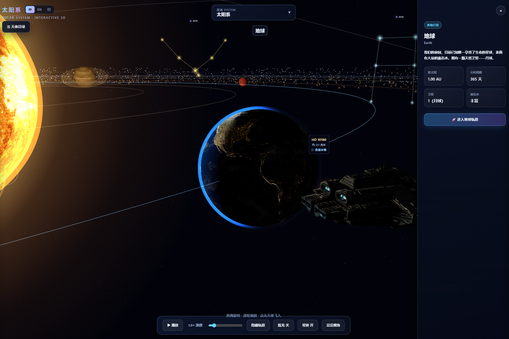

# 太阳系 · Solar System (Interactive 3D)

**文档：** 中文 · [English](README.en.md) · [日本語](README.ja.md)

用 React + Three.js 打造的交互式 3D 太阳系。写实贴图与程序化材质结合，配合 Bloom 泛光、大气辉光、曲速跃迁与多语言界面，可从太阳系漫游到系外行星与黑洞场景。

## 预览

### 太阳系总览

拖拽旋转、滚轮缩放，一览太阳、八大行星轨道、小行星带与黄道星座。



### 地球与星舰

点击天体打开信息面板，查看中文/英文/日文介绍；「秋风之敦号」星舰可在行星间巡航，并支持驾驶舱与追尾视角。



## 功能

- 🌞 **太阳**：着色器流动表面 + 多层日冕辉光
- 🪐 **八大行星**：公转 / 自转、真实自转轴倾角、土星环与天王星环
- 🌍 **地球**：云层、夜侧灯光与大气辉光
- 🌙 **卫星**：月球及主要天然卫星绕行星运转
- ☄️ **小天体**：小行星带、柯伊伯带、彗星
- ✨ **星座**：黄道十二星座连线与标签
- 🚀 **星舰**：GLB 模型、航线巡航、环绕轨道、驾驶舱 HUD
- 🛰 **空间站**：火星轨道运行，带 glow / 粒子效果
- 🌌 **曲速跃迁**：切换至 5 个多行星系外系统或 6 颗著名黑洞独立场景
- 🕳 **黑洞**：吸积盘 shader、引力透镜、喷流、多普勒明暗
- 🌐 **多语言**：中文 / English / 日本語 UI 切换（偏好写入 localStorage）
- 🖱️ **交互**：点击飞入、轨道视角、左侧天体目录、底部控制条

## 运行

```bash
npm install
npm run dev      # http://localhost:5405
npm run build    # 生产构建
npm run preview  # 预览生产构建
```

需要 Node 18+。

## 技术栈

- **Vite + React 18 + TypeScript**
- **Three.js** + **@react-three/fiber** + **@react-three/drei**
- **@react-three/postprocessing**（Bloom）
- **Zustand**（状态管理）
- **GSAP**（相机与曲速动画）

## 贴图与模型

- 行星表面可使用 `public/textures/` 中的真实贴图，或由 `src/utils/textures.ts` 程序化生成
- 星舰 / 空间站 GLB 模型位于 `public/models/`

## Bloom 开关说明

Bloom 在部分 Windows / ANGLE 组合下可能黑屏（已设 `multisampling={0}`）。底部控制条可关闭 Bloom，日冕、大气、轨道发光仍保留。

## 目录结构

```
src/
  data/           # 天体、系外系统、黑洞、星座等数据
  i18n/           # 中 / EN / 日 文案与面板翻译
  store/          # Zustand 全局状态
  scene/          # 3D 场景组件
  components/     # UI：侧边栏、信息面板、控制条等
  utils/          # 程序化贴图等工具
pic/              # README 截图
public/
  models/         # GLB 模型
  textures/       # 行星贴图
```

## License

[MIT](LICENSE) © 2026 [wujinsen](https://github.com/wujinsen)
